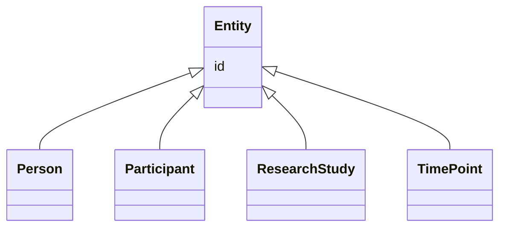

# Class: Entity


_Any resource that has its own identifier_


* __NOTE__: this is an abstract class and should not be instantiated directly


URI: [schema:Thing](http://schema.org/Thing)





## Inheritance
* **Entity**
    * [Person](Person.md)
    * [Participant](Participant.md)
    * [ResearchStudy](ResearchStudy.md)
    * [TimePoint](TimePoint.md)


## Slots

| Name | Cardinality and Range | Description | Inheritance |
| ---  | --- | --- | --- |
| [id](id.md) | 1..1 <br/> [Uriorcurie](Uriorcurie.md) | The 'logical' identifier of the entity within the system of record | direct |


## Identifier and Mapping Information


### Schema Source


* from schema: https://w3id.org/nhlbidatastage/bdchm


## Mappings

| Mapping Type | Mapped Value |
| ---  | ---  |
| self | schema:Thing |
| native | bdchm:Entity |


## LinkML Source

<!-- TODO: investigate https://stackoverflow.com/questions/37606292/how-to-create-tabbed-code-blocks-in-mkdocs-or-sphinx -->

### Direct

<details>
```yaml
name: Entity
description: Any resource that has its own identifier
from_schema: https://w3id.org/nhlbidatastage/bdchm
abstract: true
slots:
- id
class_uri: schema:Thing

```
</details>

### Induced

<details>
```yaml
name: Entity
description: Any resource that has its own identifier
from_schema: https://w3id.org/nhlbidatastage/bdchm
abstract: true
attributes:
  id:
    name: id
    description: The 'logical' identifier of the entity within the system of record.  The
      simple value of this attribute stands for an identifier of this data object
      within the system, it can be used as a reference from other objects within the
      same system (i.e. primary and foreign keys), and it should be unique per type
      of object. The same data object copied to a different system will likely have
      a different "id" in the new system since "id" values are system specific and
      do not represent persistent business identifiers. Business identifiers are assigned
      outside the information system and are captured in the "identifier" field. The
      "id" field is more likely to be a serially or randomly generated value that
      is assigned to the data object as it is created in a system.
    from_schema: https://w3id.org/nhlbidatastage/bdchm
    rank: 1000
    slot_uri: schema:identifier
    identifier: true
    alias: id
    owner: Entity
    domain_of:
    - Entity
    range: uriorcurie
class_uri: schema:Thing

```
</details>