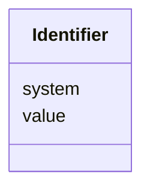

# Class: Identifier


_An Identifier is associated with a unique object or entity within a given system.  _


URI: [bdchm:Identifier](bdchm:Identifier)





<!-- no inheritance hierarchy -->


## Slots

| Name | Cardinality and Range | Description | Inheritance |
| ---  | --- | --- | --- |
| [value](value.md) | 1..1 <br/> [String](String.md) | The value of the identifier, as defined by the system | direct |
| [system](system.md) | 0..1 <br/> [String](String.md) | The system or namespace that defines the identifier | direct |


## Usages

| used by | used in | type | used |
| ---  | --- | --- | --- |
| [Person](Person.md) | [identity](identity.md) | range | [Identifier](Identifier.md) |
| [Participant](Participant.md) | [identity](identity.md) | range | [Identifier](Identifier.md) |
| [ResearchStudy](ResearchStudy.md) | [identity](identity.md) | range | [Identifier](Identifier.md) |


## Identifier and Mapping Information


### Schema Source


* from schema: https://w3id.org/nhlbidatastage/bdchm


## Mappings

| Mapping Type | Mapped Value |
| ---  | ---  |
| self | bdchm:Identifier |
| native | bdchm:Identifier |


## LinkML Source

<!-- TODO: investigate https://stackoverflow.com/questions/37606292/how-to-create-tabbed-code-blocks-in-mkdocs-or-sphinx -->

### Direct

<details>
```yaml
name: Identifier
description: 'An Identifier is associated with a unique object or entity within a
  given system.  '
from_schema: https://w3id.org/nhlbidatastage/bdchm
attributes:
  value:
    name: value
    description: The value of the identifier, as defined by the system.
    from_schema: https://w3id.org/nhlbidatastage/bdchm
    rank: 1000
    range: string
    required: true
  system:
    name: system
    description: The system or namespace that defines the identifier.
    from_schema: https://w3id.org/nhlbidatastage/bdchm
    rank: 1000
    range: string

```
</details>

### Induced

<details>
```yaml
name: Identifier
description: 'An Identifier is associated with a unique object or entity within a
  given system.  '
from_schema: https://w3id.org/nhlbidatastage/bdchm
attributes:
  value:
    name: value
    description: The value of the identifier, as defined by the system.
    from_schema: https://w3id.org/nhlbidatastage/bdchm
    rank: 1000
    alias: value
    owner: Identifier
    domain_of:
    - Identifier
    range: string
    required: true
  system:
    name: system
    description: The system or namespace that defines the identifier.
    from_schema: https://w3id.org/nhlbidatastage/bdchm
    rank: 1000
    alias: system
    owner: Identifier
    domain_of:
    - Identifier
    range: string

```
</details>