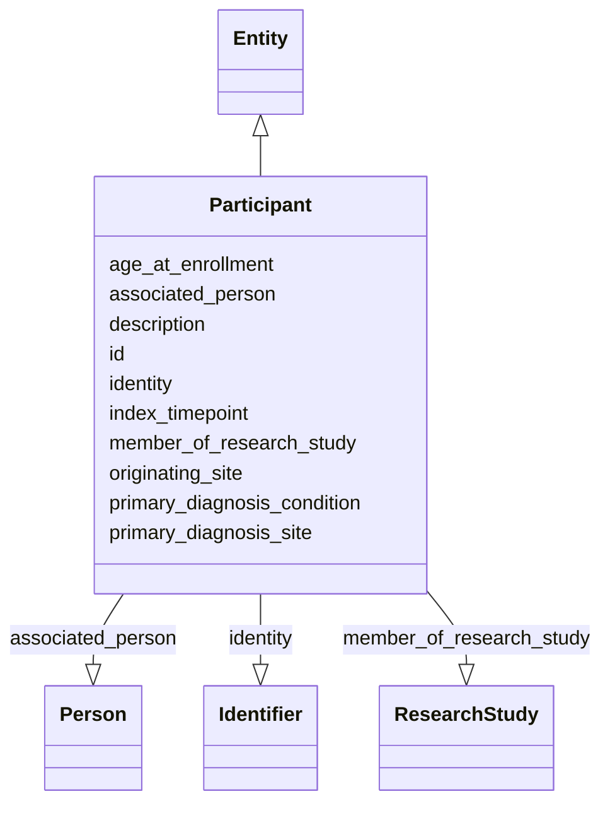

# Class: Participant


_A Participant is the entity of interest in a research study, typically a human being or an animal, but can also be a device, group of humans or animals, or a tissue sample. Human research subjects are usually not traceable to a particular person to protect the subject’s privacy._


URI: [bdchm:Participant](bdchm:Participant)





## Inheritance
* [Entity](Entity.md)
    * **Participant**


## Slots

| Name | Cardinality and Range | Description | Inheritance |
| ---  | --- | --- | --- |
| [associated_person](associated_person.md) | 0..1 <br/> [Person](Person.md) | A reference to the Person that is associated with this record | direct |
| [identity](identity.md) | 0..1 <br/> [Identifier](Identifier.md) | A 'business' identifier or accession number for the entity, typically as prov... | direct |
| [description](description.md) | 0..1 <br/> [String](String.md) | A free text field to capture additional info/explanation about the research s... | direct |
| [member_of_research_study](member_of_research_study.md) | 0..1 <br/> [ResearchStudy](ResearchStudy.md) | A reference to the Study(s) of which this Participant is a member | direct |
| [age_at_enrollment](age_at_enrollment.md) | 0..1 <br/> [String](String.md) | The age in days when the Participant enrolled on the ResearchStudy | direct |
| [primary_diagnosis_condition](primary_diagnosis_condition.md) | 0..1 <br/> [String](String.md) | This attribute represents the disease that qualified the subject for inclusio... | direct |
| [primary_diagnosis_site](primary_diagnosis_site.md) | 0..1 <br/> [String](String.md) | The text term used to describe the primary site of disease, as categorized by... | direct |
| [index_timepoint](index_timepoint.md) | 0..1 <br/> [String](String.md) | The text term used to describe the reference or anchor date used for date obf... | direct |
| [originating_site](originating_site.md) | 0..1 <br/> [String](String.md) | The Organization through which a subject was enrolled on a ResearchStudy | direct |
| [id](id.md) | 1..1 <br/> [Uriorcurie](Uriorcurie.md) | The 'logical' identifier of the entity within the system of record | [Entity](Entity.md) |


## Identifier and Mapping Information


### Schema Source


* from schema: https://w3id.org/nhlbidatastage/bdchm


## Mappings

| Mapping Type | Mapped Value |
| ---  | ---  |
| self | bdchm:Participant |
| native | bdchm:Participant |


## LinkML Source

<!-- TODO: investigate https://stackoverflow.com/questions/37606292/how-to-create-tabbed-code-blocks-in-mkdocs-or-sphinx -->

### Direct

<details>
```yaml
name: Participant
description: A Participant is the entity of interest in a research study, typically
  a human being or an animal, but can also be a device, group of humans or animals,
  or a tissue sample. Human research subjects are usually not traceable to a particular
  person to protect the subject’s privacy.
from_schema: https://w3id.org/nhlbidatastage/bdchm
is_a: Entity
slots:
- associated_person
- identity
attributes:
  description:
    name: description
    description: A free text field to capture additional info/explanation about the
      research subject.
    from_schema: https://w3id.org/nhlbidatastage/bdchm
    rank: 1000
    range: string
  member_of_research_study:
    name: member_of_research_study
    description: A reference to the Study(s) of which this Participant is a member
    from_schema: https://w3id.org/nhlbidatastage/bdchm
    rank: 1000
    range: ResearchStudy
  age_at_enrollment:
    name: age_at_enrollment
    description: The age in days when the Participant enrolled on the ResearchStudy
    from_schema: https://w3id.org/nhlbidatastage/bdchm
    rank: 1000
    range: string
  primary_diagnosis_condition:
    name: primary_diagnosis_condition
    description: This attribute represents the disease that qualified the subject
      for inclusion on the ResearchStudy
    from_schema: https://w3id.org/nhlbidatastage/bdchm
    rank: 1000
    range: string
  primary_diagnosis_site:
    name: primary_diagnosis_site
    description: The text term used to describe the primary site of disease, as categorized
      by the World Health Organization's (WHO) International Classification of Diseases
      for Oncology (ICD-O). This categorization groups cases into general categories.  This
      attribute represents the primary site of disease that qualified the subject
      for inclusion on the ResearchStudy.
    from_schema: https://w3id.org/nhlbidatastage/bdchm
    rank: 1000
    range: string
  index_timepoint:
    name: index_timepoint
    description: The text term used to describe the reference or anchor date used
      for date obfuscation, where a single date is obscured by creating one or more
      date ranges in relation to this date.
    from_schema: https://w3id.org/nhlbidatastage/bdchm
    rank: 1000
    range: string
  originating_site:
    name: originating_site
    description: The Organization through which a subject was enrolled on a ResearchStudy.
    from_schema: https://w3id.org/nhlbidatastage/bdchm
    rank: 1000
    range: string

```
</details>

### Induced

<details>
```yaml
name: Participant
description: A Participant is the entity of interest in a research study, typically
  a human being or an animal, but can also be a device, group of humans or animals,
  or a tissue sample. Human research subjects are usually not traceable to a particular
  person to protect the subject’s privacy.
from_schema: https://w3id.org/nhlbidatastage/bdchm
is_a: Entity
attributes:
  description:
    name: description
    description: A free text field to capture additional info/explanation about the
      research subject.
    from_schema: https://w3id.org/nhlbidatastage/bdchm
    rank: 1000
    alias: description
    owner: Participant
    domain_of:
    - Participant
    - ResearchStudy
    range: string
  member_of_research_study:
    name: member_of_research_study
    description: A reference to the Study(s) of which this Participant is a member
    from_schema: https://w3id.org/nhlbidatastage/bdchm
    rank: 1000
    alias: member_of_research_study
    owner: Participant
    domain_of:
    - Participant
    range: ResearchStudy
  age_at_enrollment:
    name: age_at_enrollment
    description: The age in days when the Participant enrolled on the ResearchStudy
    from_schema: https://w3id.org/nhlbidatastage/bdchm
    rank: 1000
    alias: age_at_enrollment
    owner: Participant
    domain_of:
    - Participant
    range: string
  primary_diagnosis_condition:
    name: primary_diagnosis_condition
    description: This attribute represents the disease that qualified the subject
      for inclusion on the ResearchStudy
    from_schema: https://w3id.org/nhlbidatastage/bdchm
    rank: 1000
    alias: primary_diagnosis_condition
    owner: Participant
    domain_of:
    - Participant
    range: string
  primary_diagnosis_site:
    name: primary_diagnosis_site
    description: The text term used to describe the primary site of disease, as categorized
      by the World Health Organization's (WHO) International Classification of Diseases
      for Oncology (ICD-O). This categorization groups cases into general categories.  This
      attribute represents the primary site of disease that qualified the subject
      for inclusion on the ResearchStudy.
    from_schema: https://w3id.org/nhlbidatastage/bdchm
    rank: 1000
    alias: primary_diagnosis_site
    owner: Participant
    domain_of:
    - Participant
    range: string
  index_timepoint:
    name: index_timepoint
    description: The text term used to describe the reference or anchor date used
      for date obfuscation, where a single date is obscured by creating one or more
      date ranges in relation to this date.
    from_schema: https://w3id.org/nhlbidatastage/bdchm
    rank: 1000
    alias: index_timepoint
    owner: Participant
    domain_of:
    - Participant
    range: string
  originating_site:
    name: originating_site
    description: The Organization through which a subject was enrolled on a ResearchStudy.
    from_schema: https://w3id.org/nhlbidatastage/bdchm
    rank: 1000
    alias: originating_site
    owner: Participant
    domain_of:
    - Participant
    range: string
  associated_person:
    name: associated_person
    description: A reference to the Person that is associated with this record.
    from_schema: https://w3id.org/nhlbidatastage/bdchm
    rank: 1000
    alias: associated_person
    owner: Participant
    domain_of:
    - Participant
    range: Person
  identity:
    name: identity
    description: A 'business' identifier or accession number for the entity, typically
      as provided by an external system or authority, that are globally unique and
      persist across implementing systems. Also, since these identifiers are created
      outside the information system through a specific business process, the Identifier
      type has additional attributes to capture this additional metadata so the actual
      identifier values are qualified by the context that created those values. This
      additional context allows "identifier" instances to be transmitted as business
      data across systems while still being able to trace them back to the system
      of origin.
    from_schema: https://w3id.org/nhlbidatastage/bdchm
    rank: 1000
    slot_uri: schema:identifier
    alias: identity
    owner: Participant
    domain_of:
    - Person
    - Participant
    - ResearchStudy
    range: Identifier
  id:
    name: id
    description: The 'logical' identifier of the entity within the system of record.  The
      simple value of this attribute stands for an identifier of this data object
      within the system, it can be used as a reference from other objects within the
      same system (i.e. primary and foreign keys), and it should be unique per type
      of object. The same data object copied to a different system will likely have
      a different "id" in the new system since "id" values are system specific and
      do not represent persistent business identifiers. Business identifiers are assigned
      outside the information system and are captured in the "identifier" field. The
      "id" field is more likely to be a serially or randomly generated value that
      is assigned to the data object as it is created in a system.
    from_schema: https://w3id.org/nhlbidatastage/bdchm
    rank: 1000
    slot_uri: schema:identifier
    identifier: true
    alias: id
    owner: Participant
    domain_of:
    - Entity
    range: uriorcurie
    required: true

```
</details>