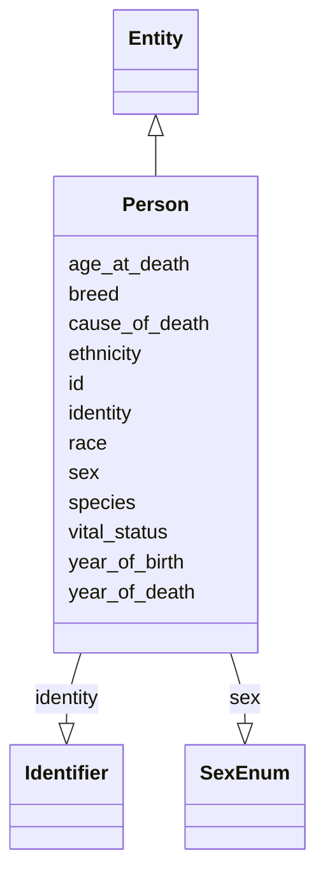

# Class: Person


_Demographics and other administrative information about an individual or animal receiving care or other health-related services._


URI: [bdchm:Person](bdchm:Person)





## Inheritance
* [Entity](Entity.md)
    * **Person**


## Slots

| Name | Cardinality and Range | Description | Inheritance |
| ---  | --- | --- | --- |
| [identity](identity.md) | 0..1 <br/> [Identifier](Identifier.md) | A 'business' identifier or accession number for the entity, typically as prov... | direct |
| [species](species.md) | 0..1 <br/> [String](String.md) | The scientific binomial name for the species of the Person (e | direct |
| [breed](breed.md) | 0..1 <br/> [String](String.md) | A label given to a group of animals homogeneous in appearance and other chara... | direct |
| [sex](sex.md) | 0..1 <br/> [SexEnum](SexEnum.md) | The biologic character or quality that distinguishes male and female from one... | direct |
| [ethnicity](ethnicity.md) | 0..1 <br/> [String](String.md) | An individual's self-described social and cultural grouping, specifically whe... | direct |
| [race](race.md) | 0..1 <br/> [String](String.md) | An arbitrary classification of a taxonomic group that is a division of a spec... | direct |
| [year_of_birth](year_of_birth.md) | 0..1 <br/> [Integer](Integer.md) | Numeric value to represent the calendar year in which an individual was born | direct |
| [vital_status](vital_status.md) | 0..1 <br/> [String](String.md) | Coded value indicating the state or condition of being living or deceased; al... | direct |
| [age_at_death](age_at_death.md) | 0..1 <br/> [String](String.md) | The age of an individual at the time of death, expressed in days since birth | direct |
| [year_of_death](year_of_death.md) | 0..1 <br/> [Integer](Integer.md) | Numeric value to represent the calendar year in which an individual died | direct |
| [cause_of_death](cause_of_death.md) | 0..1 <br/> [String](String.md) | Coded value indicating the circumstance or condition that results in the deat... | direct |
| [id](id.md) | 1..1 <br/> [Uriorcurie](Uriorcurie.md) | The 'logical' identifier of the entity within the system of record | [Entity](Entity.md) |


## Usages

| used by | used in | type | used |
| ---  | --- | --- | --- |
| [Participant](Participant.md) | [associated_person](associated_person.md) | range | [Person](Person.md) |


## Identifier and Mapping Information


### Schema Source


* from schema: https://w3id.org/nhlbidatastage/bdchm


## Mappings

| Mapping Type | Mapped Value |
| ---  | ---  |
| self | bdchm:Person |
| native | bdchm:Person |


## LinkML Source

<!-- TODO: investigate https://stackoverflow.com/questions/37606292/how-to-create-tabbed-code-blocks-in-mkdocs-or-sphinx -->

### Direct

<details>
```yaml
name: Person
description: Demographics and other administrative information about an individual
  or animal receiving care or other health-related services.
from_schema: https://w3id.org/nhlbidatastage/bdchm
is_a: Entity
slots:
- identity
attributes:
  species:
    name: species
    description: The scientific binomial name for the species of the Person (e.g.
      Homo sapiens, Mus musculus, etc.)
    from_schema: https://w3id.org/nhlbidatastage/bdchm
    rank: 1000
    range: string
  breed:
    name: breed
    description: A label given to a group of animals homogeneous in appearance and
      other characteristics that distinguish it from other animals of the same species.
    from_schema: https://w3id.org/nhlbidatastage/bdchm
    rank: 1000
    range: string
  sex:
    name: sex
    description: The biologic character or quality that distinguishes male and female
      from one another as expressed by analysis of the person's gonadal, morphologic
      (internal and external), chromosomal, and hormonal characteristics.
    from_schema: https://w3id.org/nhlbidatastage/bdchm
    rank: 1000
    range: SexEnum
  ethnicity:
    name: ethnicity
    description: An individual's self-described social and cultural grouping, specifically
      whether an individual describes themselves as Hispanic or Latino. The provided
      values are based on the categories defined by the U.S. Office of Management
      and Business and used by the U.S. Census Bureau
    from_schema: https://w3id.org/nhlbidatastage/bdchm
    rank: 1000
    range: string
  race:
    name: race
    description: An arbitrary classification of a taxonomic group that is a division
      of a species. It usually arises as a consequence of geographical isolation within
      a species and is characterized by shared heredity, physical attributes and behavior,
      and in the case of humans, by common history, nationality, or geographic distribution.
      The provided values are based on the categories defined by the U.S. Office of
      Management and Business and used by the U.S. Census Bureau.
    from_schema: https://w3id.org/nhlbidatastage/bdchm
    rank: 1000
    range: string
  year_of_birth:
    name: year_of_birth
    description: Numeric value to represent the calendar year in which an individual
      was born.
    from_schema: https://w3id.org/nhlbidatastage/bdchm
    rank: 1000
    range: integer
  vital_status:
    name: vital_status
    description: Coded value indicating the state or condition of being living or
      deceased; also includes the case where the vital status is unknown.
    from_schema: https://w3id.org/nhlbidatastage/bdchm
    rank: 1000
    range: string
  age_at_death:
    name: age_at_death
    description: The age of an individual at the time of death, expressed in days
      since birth
    from_schema: https://w3id.org/nhlbidatastage/bdchm
    rank: 1000
    range: string
  year_of_death:
    name: year_of_death
    description: Numeric value to represent the calendar year in which an individual
      died.
    from_schema: https://w3id.org/nhlbidatastage/bdchm
    rank: 1000
    range: integer
  cause_of_death:
    name: cause_of_death
    description: Coded value indicating the circumstance or condition that results
      in the death of the individual.
    from_schema: https://w3id.org/nhlbidatastage/bdchm
    rank: 1000
    range: string

```
</details>

### Induced

<details>
```yaml
name: Person
description: Demographics and other administrative information about an individual
  or animal receiving care or other health-related services.
from_schema: https://w3id.org/nhlbidatastage/bdchm
is_a: Entity
attributes:
  species:
    name: species
    description: The scientific binomial name for the species of the Person (e.g.
      Homo sapiens, Mus musculus, etc.)
    from_schema: https://w3id.org/nhlbidatastage/bdchm
    rank: 1000
    alias: species
    owner: Person
    domain_of:
    - Person
    range: string
  breed:
    name: breed
    description: A label given to a group of animals homogeneous in appearance and
      other characteristics that distinguish it from other animals of the same species.
    from_schema: https://w3id.org/nhlbidatastage/bdchm
    rank: 1000
    alias: breed
    owner: Person
    domain_of:
    - Person
    range: string
  sex:
    name: sex
    description: The biologic character or quality that distinguishes male and female
      from one another as expressed by analysis of the person's gonadal, morphologic
      (internal and external), chromosomal, and hormonal characteristics.
    from_schema: https://w3id.org/nhlbidatastage/bdchm
    rank: 1000
    alias: sex
    owner: Person
    domain_of:
    - Person
    range: SexEnum
  ethnicity:
    name: ethnicity
    description: An individual's self-described social and cultural grouping, specifically
      whether an individual describes themselves as Hispanic or Latino. The provided
      values are based on the categories defined by the U.S. Office of Management
      and Business and used by the U.S. Census Bureau
    from_schema: https://w3id.org/nhlbidatastage/bdchm
    rank: 1000
    alias: ethnicity
    owner: Person
    domain_of:
    - Person
    range: string
  race:
    name: race
    description: An arbitrary classification of a taxonomic group that is a division
      of a species. It usually arises as a consequence of geographical isolation within
      a species and is characterized by shared heredity, physical attributes and behavior,
      and in the case of humans, by common history, nationality, or geographic distribution.
      The provided values are based on the categories defined by the U.S. Office of
      Management and Business and used by the U.S. Census Bureau.
    from_schema: https://w3id.org/nhlbidatastage/bdchm
    rank: 1000
    alias: race
    owner: Person
    domain_of:
    - Person
    range: string
  year_of_birth:
    name: year_of_birth
    description: Numeric value to represent the calendar year in which an individual
      was born.
    from_schema: https://w3id.org/nhlbidatastage/bdchm
    rank: 1000
    alias: year_of_birth
    owner: Person
    domain_of:
    - Person
    range: integer
  vital_status:
    name: vital_status
    description: Coded value indicating the state or condition of being living or
      deceased; also includes the case where the vital status is unknown.
    from_schema: https://w3id.org/nhlbidatastage/bdchm
    rank: 1000
    alias: vital_status
    owner: Person
    domain_of:
    - Person
    range: string
  age_at_death:
    name: age_at_death
    description: The age of an individual at the time of death, expressed in days
      since birth
    from_schema: https://w3id.org/nhlbidatastage/bdchm
    rank: 1000
    alias: age_at_death
    owner: Person
    domain_of:
    - Person
    range: string
  year_of_death:
    name: year_of_death
    description: Numeric value to represent the calendar year in which an individual
      died.
    from_schema: https://w3id.org/nhlbidatastage/bdchm
    rank: 1000
    alias: year_of_death
    owner: Person
    domain_of:
    - Person
    range: integer
  cause_of_death:
    name: cause_of_death
    description: Coded value indicating the circumstance or condition that results
      in the death of the individual.
    from_schema: https://w3id.org/nhlbidatastage/bdchm
    rank: 1000
    alias: cause_of_death
    owner: Person
    domain_of:
    - Person
    range: string
  identity:
    name: identity
    description: A 'business' identifier or accession number for the entity, typically
      as provided by an external system or authority, that are globally unique and
      persist across implementing systems. Also, since these identifiers are created
      outside the information system through a specific business process, the Identifier
      type has additional attributes to capture this additional metadata so the actual
      identifier values are qualified by the context that created those values. This
      additional context allows "identifier" instances to be transmitted as business
      data across systems while still being able to trace them back to the system
      of origin.
    from_schema: https://w3id.org/nhlbidatastage/bdchm
    rank: 1000
    slot_uri: schema:identifier
    alias: identity
    owner: Person
    domain_of:
    - Person
    - Participant
    - ResearchStudy
    range: Identifier
  id:
    name: id
    description: The 'logical' identifier of the entity within the system of record.  The
      simple value of this attribute stands for an identifier of this data object
      within the system, it can be used as a reference from other objects within the
      same system (i.e. primary and foreign keys), and it should be unique per type
      of object. The same data object copied to a different system will likely have
      a different "id" in the new system since "id" values are system specific and
      do not represent persistent business identifiers. Business identifiers are assigned
      outside the information system and are captured in the "identifier" field. The
      "id" field is more likely to be a serially or randomly generated value that
      is assigned to the data object as it is created in a system.
    from_schema: https://w3id.org/nhlbidatastage/bdchm
    rank: 1000
    slot_uri: schema:identifier
    identifier: true
    alias: id
    owner: Person
    domain_of:
    - Entity
    range: uriorcurie
    required: true

```
</details>