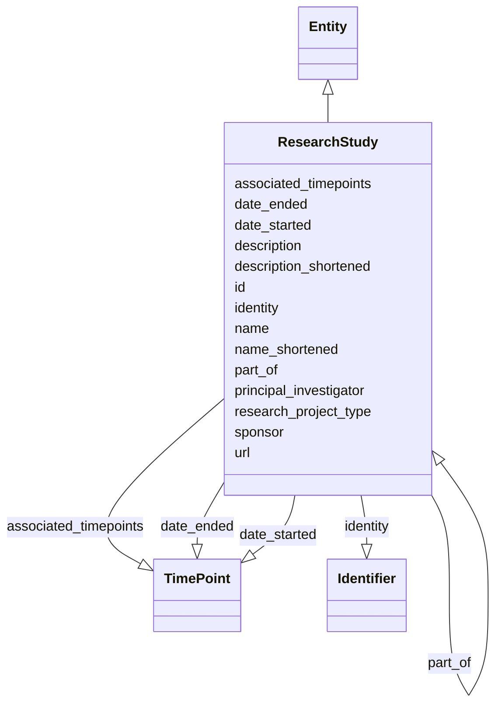

# Class: ResearchStudy


_A process where a researcher or organization plans and then executes a series of steps intended to increase the field of healthcare-related knowledge. This includes studies of safety, efficacy, comparative effectiveness and other information about medications, devices, therapies and other interventional and investigative techniques. A ResearchStudy involves the gathering of information about human or animal subjects._


URI: [bdchm:ResearchStudy](bdchm:ResearchStudy)





## Inheritance
* [Entity](Entity.md)
    * **ResearchStudy**


## Slots

| Name | Cardinality and Range | Description | Inheritance |
| ---  | --- | --- | --- |
| [identity](identity.md) | 0..1 <br/> [Identifier](Identifier.md) | A 'business' identifier or accession number for the entity, typically as prov... | direct |
| [name](name.md) | 0..1 <br/> [String](String.md) | An unabridged name of a research program, project, or study | direct |
| [name_shortened](name_shortened.md) | 0..1 <br/> [String](String.md) | An abbreviated name of a research program, project, or study | direct |
| [description](description.md) | 0..1 <br/> [String](String.md) | An unabridged description of a research program, project, or study | direct |
| [description_shortened](description_shortened.md) | 0..1 <br/> [String](String.md) | An abbreviated description of a research program, project, or study | direct |
| [sponsor](sponsor.md) | 0..1 <br/> [String](String.md) | An entity that is responsible for the initiation, management, and/or financin... | direct |
| [date_started](date_started.md) | 0..1 <br/> [TimePoint](TimePoint.md) | The date when the research project began | direct |
| [date_ended](date_ended.md) | 0..1 <br/> [TimePoint](TimePoint.md) | The date when the research project ended | direct |
| [url](url.md) | 0..1 <br/> [Uriorcurie](Uriorcurie.md) | A URL address for a resource that provides information about a research progr... | direct |
| [part_of](part_of.md) | 0..1 <br/> [ResearchStudy](ResearchStudy.md) | A reference to a parent ResearchStudy (e | direct |
| [research_project_type](research_project_type.md) | 0..1 <br/> [String](String.md) | The 'type' of ResearchStudy represented (e | direct |
| [associated_timepoints](associated_timepoints.md) | 0..* <br/> [TimePoint](TimePoint.md) | A collection of timepoint observations that are relevant to research projects... | direct |
| [principal_investigator](principal_investigator.md) | 0..* <br/> [String](String.md) | The investigator or investigators leading a project | direct |
| [id](id.md) | 1..1 <br/> [Uriorcurie](Uriorcurie.md) | The 'logical' identifier of the entity within the system of record | [Entity](Entity.md) |


## Usages

| used by | used in | type | used |
| ---  | --- | --- | --- |
| [Participant](Participant.md) | [member_of_research_study](member_of_research_study.md) | range | [ResearchStudy](ResearchStudy.md) |
| [ResearchStudy](ResearchStudy.md) | [part_of](part_of.md) | range | [ResearchStudy](ResearchStudy.md) |
| [ResearchStudyCollection](ResearchStudyCollection.md) | [entries](entries.md) | range | [ResearchStudy](ResearchStudy.md) |


## Identifier and Mapping Information


### Schema Source


* from schema: https://w3id.org/nhlbidatastage/bdchm


## Mappings

| Mapping Type | Mapped Value |
| ---  | ---  |
| self | bdchm:ResearchStudy |
| native | bdchm:ResearchStudy |


## LinkML Source

<!-- TODO: investigate https://stackoverflow.com/questions/37606292/how-to-create-tabbed-code-blocks-in-mkdocs-or-sphinx -->

### Direct

<details>
```yaml
name: ResearchStudy
description: A process where a researcher or organization plans and then executes
  a series of steps intended to increase the field of healthcare-related knowledge.
  This includes studies of safety, efficacy, comparative effectiveness and other information
  about medications, devices, therapies and other interventional and investigative
  techniques. A ResearchStudy involves the gathering of information about human or
  animal subjects.
from_schema: https://w3id.org/nhlbidatastage/bdchm
is_a: Entity
slots:
- identity
attributes:
  name:
    name: name
    description: An unabridged name of a research program, project, or study.
    from_schema: https://w3id.org/nhlbidatastage/bdchm
    rank: 1000
    range: string
  name_shortened:
    name: name_shortened
    description: An abbreviated name of a research program, project, or study.
    from_schema: https://w3id.org/nhlbidatastage/bdchm
    rank: 1000
    range: string
  description:
    name: description
    description: An unabridged description of a research program, project, or study.
    from_schema: https://w3id.org/nhlbidatastage/bdchm
    range: string
  description_shortened:
    name: description_shortened
    description: An abbreviated description of a research program, project, or study.
    from_schema: https://w3id.org/nhlbidatastage/bdchm
    rank: 1000
    range: string
  sponsor:
    name: sponsor
    description: An entity that is responsible for the initiation, management, and/or
      financing of a research project.
    from_schema: https://w3id.org/nhlbidatastage/bdchm
    rank: 1000
    range: string
  date_started:
    name: date_started
    description: The date when the research project began.
    from_schema: https://w3id.org/nhlbidatastage/bdchm
    rank: 1000
    range: TimePoint
  date_ended:
    name: date_ended
    description: The date when the research project ended.
    from_schema: https://w3id.org/nhlbidatastage/bdchm
    rank: 1000
    range: TimePoint
  url:
    name: url
    description: A URL address for a resource that provides information about a research
      program, project, or study.
    from_schema: https://w3id.org/nhlbidatastage/bdchm
    rank: 1000
    range: uriorcurie
  part_of:
    name: part_of
    description: A reference to a parent ResearchStudy (e.g. a link to the overarching
      CPTAC ResearchStudy from a substudy of CPTAC)
    from_schema: https://w3id.org/nhlbidatastage/bdchm
    rank: 1000
    range: ResearchStudy
  research_project_type:
    name: research_project_type
    description: The 'type' of ResearchStudy represented (e.g. a broad-based Program
      like 'CPTAC' or a more focused Project like 'CPTAC PDAC Discovery Study')
    from_schema: https://w3id.org/nhlbidatastage/bdchm
    rank: 1000
    range: string
  associated_timepoints:
    name: associated_timepoints
    description: A collection of timepoint observations that are relevant to research
      projects (e.g. date of IACUC approval, date of IRB approval, date of embargo
      end, etc.)
    from_schema: https://w3id.org/nhlbidatastage/bdchm
    rank: 1000
    multivalued: true
    range: TimePoint
  principal_investigator:
    name: principal_investigator
    description: The investigator or investigators leading a project.
    from_schema: https://w3id.org/nhlbidatastage/bdchm
    rank: 1000
    multivalued: true
    range: string

```
</details>

### Induced

<details>
```yaml
name: ResearchStudy
description: A process where a researcher or organization plans and then executes
  a series of steps intended to increase the field of healthcare-related knowledge.
  This includes studies of safety, efficacy, comparative effectiveness and other information
  about medications, devices, therapies and other interventional and investigative
  techniques. A ResearchStudy involves the gathering of information about human or
  animal subjects.
from_schema: https://w3id.org/nhlbidatastage/bdchm
is_a: Entity
attributes:
  name:
    name: name
    description: An unabridged name of a research program, project, or study.
    from_schema: https://w3id.org/nhlbidatastage/bdchm
    rank: 1000
    alias: name
    owner: ResearchStudy
    domain_of:
    - ResearchStudy
    range: string
  name_shortened:
    name: name_shortened
    description: An abbreviated name of a research program, project, or study.
    from_schema: https://w3id.org/nhlbidatastage/bdchm
    rank: 1000
    alias: name_shortened
    owner: ResearchStudy
    domain_of:
    - ResearchStudy
    range: string
  description:
    name: description
    description: An unabridged description of a research program, project, or study.
    from_schema: https://w3id.org/nhlbidatastage/bdchm
    alias: description
    owner: ResearchStudy
    domain_of:
    - Participant
    - ResearchStudy
    range: string
  description_shortened:
    name: description_shortened
    description: An abbreviated description of a research program, project, or study.
    from_schema: https://w3id.org/nhlbidatastage/bdchm
    rank: 1000
    alias: description_shortened
    owner: ResearchStudy
    domain_of:
    - ResearchStudy
    range: string
  sponsor:
    name: sponsor
    description: An entity that is responsible for the initiation, management, and/or
      financing of a research project.
    from_schema: https://w3id.org/nhlbidatastage/bdchm
    rank: 1000
    alias: sponsor
    owner: ResearchStudy
    domain_of:
    - ResearchStudy
    range: string
  date_started:
    name: date_started
    description: The date when the research project began.
    from_schema: https://w3id.org/nhlbidatastage/bdchm
    rank: 1000
    alias: date_started
    owner: ResearchStudy
    domain_of:
    - ResearchStudy
    range: TimePoint
  date_ended:
    name: date_ended
    description: The date when the research project ended.
    from_schema: https://w3id.org/nhlbidatastage/bdchm
    rank: 1000
    alias: date_ended
    owner: ResearchStudy
    domain_of:
    - ResearchStudy
    range: TimePoint
  url:
    name: url
    description: A URL address for a resource that provides information about a research
      program, project, or study.
    from_schema: https://w3id.org/nhlbidatastage/bdchm
    rank: 1000
    alias: url
    owner: ResearchStudy
    domain_of:
    - ResearchStudy
    range: uriorcurie
  part_of:
    name: part_of
    description: A reference to a parent ResearchStudy (e.g. a link to the overarching
      CPTAC ResearchStudy from a substudy of CPTAC)
    from_schema: https://w3id.org/nhlbidatastage/bdchm
    rank: 1000
    alias: part_of
    owner: ResearchStudy
    domain_of:
    - ResearchStudy
    range: ResearchStudy
  research_project_type:
    name: research_project_type
    description: The 'type' of ResearchStudy represented (e.g. a broad-based Program
      like 'CPTAC' or a more focused Project like 'CPTAC PDAC Discovery Study')
    from_schema: https://w3id.org/nhlbidatastage/bdchm
    rank: 1000
    alias: research_project_type
    owner: ResearchStudy
    domain_of:
    - ResearchStudy
    range: string
  associated_timepoints:
    name: associated_timepoints
    description: A collection of timepoint observations that are relevant to research
      projects (e.g. date of IACUC approval, date of IRB approval, date of embargo
      end, etc.)
    from_schema: https://w3id.org/nhlbidatastage/bdchm
    rank: 1000
    multivalued: true
    alias: associated_timepoints
    owner: ResearchStudy
    domain_of:
    - ResearchStudy
    range: TimePoint
  principal_investigator:
    name: principal_investigator
    description: The investigator or investigators leading a project.
    from_schema: https://w3id.org/nhlbidatastage/bdchm
    rank: 1000
    multivalued: true
    alias: principal_investigator
    owner: ResearchStudy
    domain_of:
    - ResearchStudy
    range: string
  identity:
    name: identity
    description: A 'business' identifier or accession number for the entity, typically
      as provided by an external system or authority, that are globally unique and
      persist across implementing systems. Also, since these identifiers are created
      outside the information system through a specific business process, the Identifier
      type has additional attributes to capture this additional metadata so the actual
      identifier values are qualified by the context that created those values. This
      additional context allows "identifier" instances to be transmitted as business
      data across systems while still being able to trace them back to the system
      of origin.
    from_schema: https://w3id.org/nhlbidatastage/bdchm
    rank: 1000
    slot_uri: schema:identifier
    alias: identity
    owner: ResearchStudy
    domain_of:
    - Person
    - Participant
    - ResearchStudy
    range: Identifier
  id:
    name: id
    description: The 'logical' identifier of the entity within the system of record.  The
      simple value of this attribute stands for an identifier of this data object
      within the system, it can be used as a reference from other objects within the
      same system (i.e. primary and foreign keys), and it should be unique per type
      of object. The same data object copied to a different system will likely have
      a different "id" in the new system since "id" values are system specific and
      do not represent persistent business identifiers. Business identifiers are assigned
      outside the information system and are captured in the "identifier" field. The
      "id" field is more likely to be a serially or randomly generated value that
      is assigned to the data object as it is created in a system.
    from_schema: https://w3id.org/nhlbidatastage/bdchm
    rank: 1000
    slot_uri: schema:identifier
    identifier: true
    alias: id
    owner: ResearchStudy
    domain_of:
    - Entity
    range: uriorcurie
    required: true

```
</details>