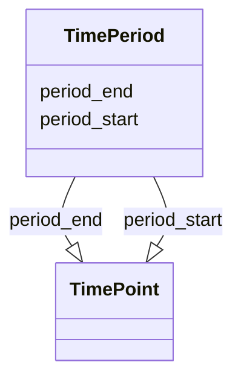

# Class: TimePeriod


_A period of time between a start and end time point._


URI: [bdchm:TimePeriod](bdchm:TimePeriod)





<!-- no inheritance hierarchy -->


## Slots

| Name | Cardinality and Range | Description | Inheritance |
| ---  | --- | --- | --- |
| [period_start](period_start.md) | 0..1 <br/> [TimePoint](TimePoint.md) | When a period of time started | direct |
| [period_end](period_end.md) | 0..1 <br/> [TimePoint](TimePoint.md) | When a period of time ended | direct |


## Identifier and Mapping Information


### Schema Source


* from schema: https://w3id.org/nhlbidatastage/bdchm


## Mappings

| Mapping Type | Mapped Value |
| ---  | ---  |
| self | bdchm:TimePeriod |
| native | bdchm:TimePeriod |


## LinkML Source

<!-- TODO: investigate https://stackoverflow.com/questions/37606292/how-to-create-tabbed-code-blocks-in-mkdocs-or-sphinx -->

### Direct

<details>
```yaml
name: TimePeriod
description: A period of time between a start and end time point.
from_schema: https://w3id.org/nhlbidatastage/bdchm
attributes:
  period_start:
    name: period_start
    description: When a period of time started.
    from_schema: https://w3id.org/nhlbidatastage/bdchm
    rank: 1000
    range: TimePoint
  period_end:
    name: period_end
    description: When a period of time ended.
    from_schema: https://w3id.org/nhlbidatastage/bdchm
    rank: 1000
    range: TimePoint

```
</details>

### Induced

<details>
```yaml
name: TimePeriod
description: A period of time between a start and end time point.
from_schema: https://w3id.org/nhlbidatastage/bdchm
attributes:
  period_start:
    name: period_start
    description: When a period of time started.
    from_schema: https://w3id.org/nhlbidatastage/bdchm
    rank: 1000
    alias: period_start
    owner: TimePeriod
    domain_of:
    - TimePeriod
    range: TimePoint
  period_end:
    name: period_end
    description: When a period of time ended.
    from_schema: https://w3id.org/nhlbidatastage/bdchm
    rank: 1000
    alias: period_end
    owner: TimePeriod
    domain_of:
    - TimePeriod
    range: TimePoint

```
</details>