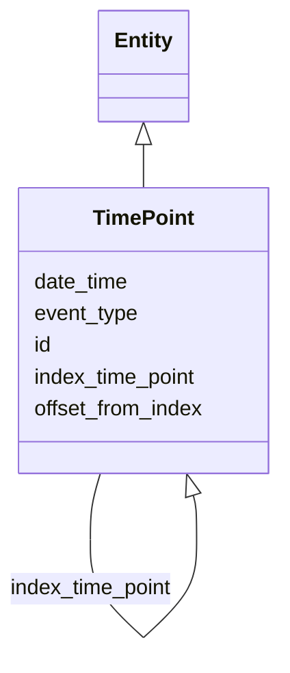

# Class: TimePoint


_A structured representation of a single point in time that allows direct/explicit declaration as a dateTime, specification in terms of offset from a defined index, or description of an event type as a proxy for the time point when it occurred._


URI: [bdchm:TimePoint](bdchm:TimePoint)





## Inheritance
* [Entity](Entity.md)
    * **TimePoint**


## Slots

| Name | Cardinality and Range | Description | Inheritance |
| ---  | --- | --- | --- |
| [date_time](date_time.md) | 0..1 <br/> [Datetime](Datetime.md) | An explicitly specified timepoint described in terms of a date and optionally... | direct |
| [index_time_point](index_time_point.md) | 0..1 <br/> [TimePoint](TimePoint.md) | Another TimePoint from which this point is offset | direct |
| [offset_from_index](offset_from_index.md) | 0..1 <br/> [String](String.md) | A quantity of time that, together with the index date or event, can be used t... | direct |
| [event_type](event_type.md) | 0..1 <br/> [String](String.md) | An event that occurred at the point in time specified by this TimePoint | direct |
| [id](id.md) | 1..1 <br/> [Uriorcurie](Uriorcurie.md) | The 'logical' identifier of the entity within the system of record | [Entity](Entity.md) |


## Usages

| used by | used in | type | used |
| ---  | --- | --- | --- |
| [ResearchStudy](ResearchStudy.md) | [date_started](date_started.md) | range | [TimePoint](TimePoint.md) |
| [ResearchStudy](ResearchStudy.md) | [date_ended](date_ended.md) | range | [TimePoint](TimePoint.md) |
| [ResearchStudy](ResearchStudy.md) | [associated_timepoints](associated_timepoints.md) | range | [TimePoint](TimePoint.md) |
| [TimePoint](TimePoint.md) | [index_time_point](index_time_point.md) | range | [TimePoint](TimePoint.md) |
| [TimePeriod](TimePeriod.md) | [period_start](period_start.md) | range | [TimePoint](TimePoint.md) |
| [TimePeriod](TimePeriod.md) | [period_end](period_end.md) | range | [TimePoint](TimePoint.md) |


## Identifier and Mapping Information


### Schema Source


* from schema: https://w3id.org/nhlbidatastage/bdchm


## Mappings

| Mapping Type | Mapped Value |
| ---  | ---  |
| self | bdchm:TimePoint |
| native | bdchm:TimePoint |


## LinkML Source

<!-- TODO: investigate https://stackoverflow.com/questions/37606292/how-to-create-tabbed-code-blocks-in-mkdocs-or-sphinx -->

### Direct

<details>
```yaml
name: TimePoint
description: A structured representation of a single point in time that allows direct/explicit
  declaration as a dateTime, specification in terms of offset from a defined index,
  or description of an event type as a proxy for the time point when it occurred.
from_schema: https://w3id.org/nhlbidatastage/bdchm
is_a: Entity
attributes:
  date_time:
    name: date_time
    description: An explicitly specified timepoint described in terms of a date and
      optionally a time on that date.
    from_schema: https://w3id.org/nhlbidatastage/bdchm
    rank: 1000
    range: datetime
  index_time_point:
    name: index_time_point
    description: Another TimePoint from which this point is offset.
    from_schema: https://w3id.org/nhlbidatastage/bdchm
    rank: 1000
    range: TimePoint
  offset_from_index:
    name: offset_from_index
    description: A quantity of time that, together with the index date or event, can
      be used to derive a specific timepoint.
    from_schema: https://w3id.org/nhlbidatastage/bdchm
    rank: 1000
    range: string
  event_type:
    name: event_type
    description: An event that occurred at the point in time specified by this TimePoint.
    from_schema: https://w3id.org/nhlbidatastage/bdchm
    rank: 1000
    range: string

```
</details>

### Induced

<details>
```yaml
name: TimePoint
description: A structured representation of a single point in time that allows direct/explicit
  declaration as a dateTime, specification in terms of offset from a defined index,
  or description of an event type as a proxy for the time point when it occurred.
from_schema: https://w3id.org/nhlbidatastage/bdchm
is_a: Entity
attributes:
  date_time:
    name: date_time
    description: An explicitly specified timepoint described in terms of a date and
      optionally a time on that date.
    from_schema: https://w3id.org/nhlbidatastage/bdchm
    rank: 1000
    alias: date_time
    owner: TimePoint
    domain_of:
    - TimePoint
    range: datetime
  index_time_point:
    name: index_time_point
    description: Another TimePoint from which this point is offset.
    from_schema: https://w3id.org/nhlbidatastage/bdchm
    rank: 1000
    alias: index_time_point
    owner: TimePoint
    domain_of:
    - TimePoint
    range: TimePoint
  offset_from_index:
    name: offset_from_index
    description: A quantity of time that, together with the index date or event, can
      be used to derive a specific timepoint.
    from_schema: https://w3id.org/nhlbidatastage/bdchm
    rank: 1000
    alias: offset_from_index
    owner: TimePoint
    domain_of:
    - TimePoint
    range: string
  event_type:
    name: event_type
    description: An event that occurred at the point in time specified by this TimePoint.
    from_schema: https://w3id.org/nhlbidatastage/bdchm
    rank: 1000
    alias: event_type
    owner: TimePoint
    domain_of:
    - TimePoint
    range: string
  id:
    name: id
    description: The 'logical' identifier of the entity within the system of record.  The
      simple value of this attribute stands for an identifier of this data object
      within the system, it can be used as a reference from other objects within the
      same system (i.e. primary and foreign keys), and it should be unique per type
      of object. The same data object copied to a different system will likely have
      a different "id" in the new system since "id" values are system specific and
      do not represent persistent business identifiers. Business identifiers are assigned
      outside the information system and are captured in the "identifier" field. The
      "id" field is more likely to be a serially or randomly generated value that
      is assigned to the data object as it is created in a system.
    from_schema: https://w3id.org/nhlbidatastage/bdchm
    rank: 1000
    slot_uri: schema:identifier
    identifier: true
    alias: id
    owner: TimePoint
    domain_of:
    - Entity
    range: uriorcurie
    required: true

```
</details>