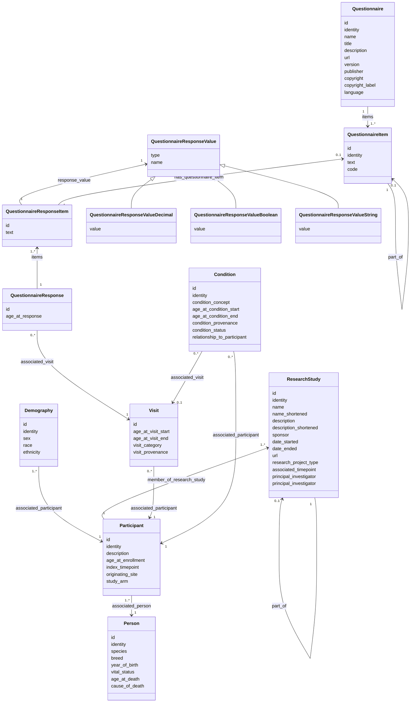

# BDCHM Model Overview

This is a high-level class diagram of the core entities present in the BioData Catalyst Harmonized Model (BDCHM).

```mermaid
classDiagram
    Participant "1..*" --> "1" Person : associated_person
    Demography "1..*" --> "1" Participant : associated_participant
    ResearchStudy "1..*" <-- "1" Participant : member_of_research_study
    ResearchStudy "0..1" <-- "1" ResearchStudy : part_of
    Visit "0..*" --> "1" Participant : associated_participant
    QuestionnaireResponse "0..*" --> "1" Visit : associated_visit
    QuestionnaireResponseItem "1..*" <-- "1" QuestionnaireResponse : items
    QuestionnaireResponseValue "1" <-- "1" QuestionnaireResponseItem : response_value
    QuestionnaireResponseValue <|-- QuestionnaireResponseValueDecimal
    QuestionnaireResponseValue <|-- QuestionnaireResponseValueBoolean
    QuestionnaireResponseValue <|-- QuestionnaireResponseValueString
    QuestionnaireItem "0..1" <-- "1" QuestionnaireResponseItem : has_questionnaire_item
    Questionnaire "1" --> "1..*" QuestionnaireItem : items
    QuestionnaireItem "1" --> "0..1" QuestionnaireItem : part_of
    Condition "0..*" --> "0..1" Visit : associated_visit
    Condition "0..*" --> "1" Participant : associated_participant
    Person : id
    Person : identity
    Person : species
    Person : breed
    Person : year_of_birth
    Person : vital_status
    Person : age_at_death
    Person : cause_of_death
    Demography : id
    Demography : identity
    Demography : sex
    Demography : race
    Demography : ethnicity
    Participant : id
    Participant : identity
    Participant : description
    Participant : age_at_enrollment
    Participant : index_timepoint
    Participant : originating_site
    Participant : study_arm
    ResearchStudy : id
    ResearchStudy : identity
    ResearchStudy : name
    ResearchStudy : name_shortened
    ResearchStudy : description
    ResearchStudy : description_shortened
    ResearchStudy : sponsor
    ResearchStudy : date_started
    ResearchStudy : date_ended
    ResearchStudy : url
    ResearchStudy : research_project_type
    ResearchStudy : associated_timepoint
    ResearchStudy : principal_investigator
    ResearchStudy : principal_investigator
    Visit : id
    Visit : age_at_visit_start
    Visit : age_at_visit_end
    Visit : visit_category
    Visit : visit_provenance
    Questionnaire : id
    Questionnaire : identity  
    Questionnaire : name
    Questionnaire : title
    Questionnaire : description
    Questionnaire : url
    Questionnaire : version
    Questionnaire : publisher
    Questionnaire : copyright
    Questionnaire : copyright_label
    Questionnaire : language
    QuestionnaireItem : id
    QuestionnaireItem : identity
    QuestionnaireItem : text
    QuestionnaireItem : code
    QuestionnaireResponse : id
    QuestionnaireResponse : age_at_response
    QuestionnaireResponseItem : id
    QuestionnaireResponseItem : text
    QuestionnaireResponseValue : type
    QuestionnaireResponseValue : name
    QuestionnaireResponseValueDecimal : value
    QuestionnaireResponseValueBoolean : value
    QuestionnaireResponseValueString : value
    Condition : id
    Condition : identity
    Condition : condition_concept
    Condition : age_at_condition_start
    Condition : age_at_condition_end
    Condition : condition_provenance
    Condition : condition_status
    Condition : relationship_to_participant
      
```
